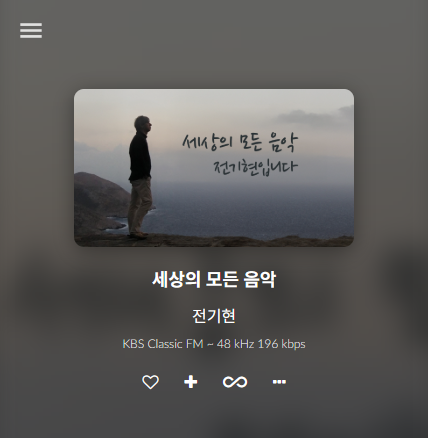

# Volumio hanradio plugin
KBS Classic FM 라디오와 CBS Music FM 라디오를 재생하는 플러그인  

## 주요 기능
- API를 파싱해서 스트리밍 주소, 프로그램명, 진행자, 앨범아트를 표시
- CBS 음악 FM은 서울방송보다 bitrate가 높은 부산방송 스트리밍 URL을 사용
- 스트리밍 메타데이터에 bitrate, samplerate를 제공하지 않아서 실시간으로 계산해서 표시
- 매 30분마다 편성표 API를 호출해서 프로그램명, 진행자, 앨범아트를 업데이트

## KBS Classic FM API
(스트리밍 URL)  
[https://cfpwwwapi.kbs.co.kr/api/v1/landing/live/channel_code/24](https://cfpwwwapi.kbs.co.kr/api/v1/landing/live/channel_code/24)
  
(편성표 URL)  
[https://static.api.kbs.co.kr/mediafactory/v1/schedule/weekly?local_station_code=00&channel_code=24](https://static.api.kbs.co.kr/mediafactory/v1/schedule/weekly?local_station_code=00&channel_code=24)

## CBS Music FM API
(스트리밍 URL - 서울)  
[https://m-aac.cbs.co.kr/mweb_cbs939/_definst_/cbs939.stream/chunklist.m3u8](https://m-aac.cbs.co.kr/mweb_cbs939/_definst_/cbs939.stream/chunklist.m3u8) 

(스트리밍 URL - 부산)  
[https://m-aac.cbs.co.kr/mweb_cbs939/_definst_/cbs939.stream/chunklist.m3u8](https://m-aac.cbs.co.kr/busan981/_definst_/busan981.stream/playlist.m3u8)  

(편성표 URL)  
[https://www.cbs.co.kr/schedule/musicfm/ajax](https://www.cbs.co.kr/schedule/musicfm/ajax)  

## 플러그인 설치방법
(공식문서 URL)   
[https://developers.volumio.com/plugins/writing-a-plugin](https://developers.volumio.com/plugins/writing-a-plugin)  

(Windows 11 기준)  
1. Volumio를 설치한 디바이스에서 {volumio url}/dev 로 접속해서 SSH 활성화
2. WinSCP 등으로 접속하여 홈디렉토리(/home/volumio)에 hanradio 디렉토리 업로드
3. Putty 등으로 접속하여 업로드한 hanradio 디렉토리로 이동
4. volumio plugin install 명령어로 플러그인 설치
5. 플러그인 관리메뉴 {volumio url}/plugin-manager에서 플러그인 활성화

